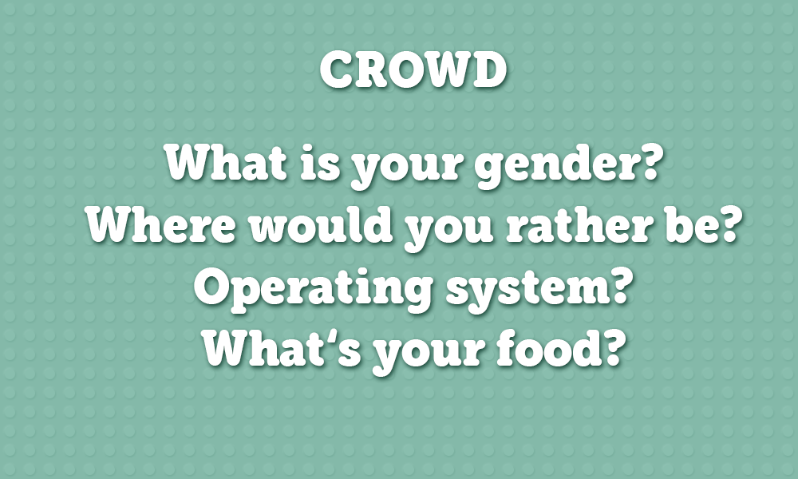

Crowd
======

This is a poll/voting game using the [HappyFunTimes party games system](http://greggman.github.io/HappyFunTimes).

TODO
----

* Controller
	* Transition/Animation between Game States
	* Show User's Score (hit vs. votes)
	* Store 'User Id' into 'cookie'/local storage to prevent double votes
	* fix Text from displaying outside
	* use divs to display text
	
* Game
	* Fix Score Board (User Names & stable+meaningful Ranking)
	* add complete animation to user pawns
	* persist voting results
	* read questions from json
 
	 

